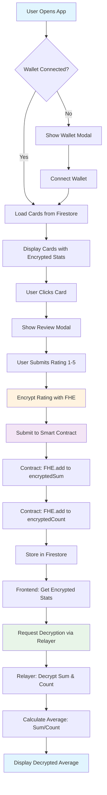

# 🛡️ ReviewsMarket - Private Rating Platform with ZAMA FHE

A decentralized platform for anonymous, private ratings of KOLs (Key Opinion Leaders), X profiles, and influencers using **ZAMA Fully Homomorphic Encryption (FHE)**. Users can submit encrypted ratings that are aggregated on-chain while maintaining complete privacy.

## 🌟 Features

- **🔐 Private Ratings**: All ratings are encrypted using ZAMA FHE
- **📊 Anonymous Aggregation**: Only average ratings are visible, individual votes remain private
- **🎯 KOL Focus**: Rate influencers, creators, and X profiles
- **⚡ Real-time Decryption**: Frontend decrypts and displays averages via relayer
- **🎨 Beautiful UI**: Sepia-themed sticky note design
- **🔗 Wallet Integration**: RainbowKit wallet connection
- **📱 Mobile Responsive**: Access from any device

## 🏗️ Project Structure

```
ReviewsMarket/
├── 📁 contract/                    # Smart contracts
│   └── ReviewCardsFHE.sol         # Main FHE contract (euint8 optimized)
├── 📁 src/                        # Frontend React application
│   ├── 📁 components/             # React components
│   │   ├── Card.tsx              # Rating card display
│   │   ├── CardGrid.tsx          # Grid of cards
│   │   ├── CreateCardModal.tsx   # Create new rating card
│   │   ├── ReviewModal.tsx       # Submit rating modal
│   │   ├── Header.tsx            # Navigation header
│   │   └── WalletConnectionModal.tsx
│   ├── 📁 utils/                 # Utility functions
│   │   ├── fheInstance.ts        # FHE operations & decryption
│   │   ├── reviewContract.ts     # Contract interactions
│   │   ├── cardsFirestore.ts     # Firestore card management
│   │   ├── ratingsFirestore.ts   # Firestore rating storage
│   │   └── commentsFirestore.ts  # Firestore comments
│   └── App.tsx                   # Main application
├── 📁 test/                      # Test suites
│   ├── RealFHE_Decryption.test.cjs    # Comprehensive FHE tests
│   └── ReviewCardsFHE_uint8.test.cjs  # Basic functionality tests
├── 📁 types/                     # TypeScript type definitions
├── 📁 artifacts/                 # Compiled contracts
└── 📁 dist/                      # Built frontend
```

## 🔄 Rating Flow & Architecture

### User Journey Flow


### System Architecture
```
┌─────────────────────────────────────────────────────────────────┐
│                        FRONTEND (React)                        │
├─────────────────────────────────────────────────────────────────┤
│  ┌─────────────┐  ┌─────────────┐  ┌─────────────┐            │
│  │   Header    │  │  CardGrid   │  │ ReviewModal │            │
│  │ (Wallet)    │  │ (Display)   │  │ (Submit)    │            │
│  └─────────────┘  └─────────────┘  └─────────────┘            │
│                                                               │
│  ┌─────────────────────────────────────────────────────────┐   │
│  │              FHE Instance (ZAMA SDK)                   │   │
│  │  • Encrypt ratings (1-5)                              │   │
│  │  • Decrypt via relayer                                │   │
│  │  • Calculate averages                                 │   │
│  └─────────────────────────────────────────────────────────┘   │
└─────────────────────────────────────────────────────────────────┘
                                │
                                ▼
┌─────────────────────────────────────────────────────────────────┐
│                    BLOCKCHAIN LAYER                            │
├─────────────────────────────────────────────────────────────────┤
│  ┌─────────────────────────────────────────────────────────┐   │
│  │              ReviewCardsFHE.sol                        │   │
│  │  • euint8 encryptedSum (homomorphic addition)         │   │
│  │  • euint8 encryptedCount (homomorphic addition)       │   │
│  │  • Double voting prevention                           │   │
│  │  • Fee management                                     │   │
│  └─────────────────────────────────────────────────────────┘   │
│                                │                               │
│  ┌─────────────────────────────────────────────────────────┐   │
│  │              ZAMA FHEVM Network                        │   │
│  │  • FHE operations execution                            │   │
│  │  • Public decryption support                          │   │
│  │  • Relayer integration                                │   │
│  └─────────────────────────────────────────────────────────┘   │
└─────────────────────────────────────────────────────────────────┘
                                │
                                ▼
┌─────────────────────────────────────────────────────────────────┐
│                    BACKEND SERVICES                            │
├─────────────────────────────────────────────────────────────────┤
│  ┌─────────────────┐  ┌─────────────────┐  ┌─────────────────┐ │
│  │   Firestore     │  │ ZAMA Relayer    │  │   Firebase      │ │
│  │  • Card metadata│  │ • Decrypt FHE   │  │  • Auth         │ │
│  │  • User ratings │  │ • Public keys   │  │  • Hosting      │ │
│  │  • Comments     │  │ • Oracle service│  │  • Functions    │ │
│  └─────────────────┘  └─────────────────┘  └─────────────────┘ │
└─────────────────────────────────────────────────────────────────┘
```

### Data Flow Diagram
```
User Rating (1-5)
        │
        ▼
┌───────────────┐
│ FHE Encryption│ ← ZAMA SDK
│ (euint8)      │
└───────────────┘
        │
        ▼
┌───────────────┐
│ Smart Contract│ ← FHE.add operations
│ (encryptedSum)│
│ (encryptedCount)│
└───────────────┘
        │
        ▼
┌───────────────┐
│ ZAMA Relayer  │ ← Public decryption
│ (Decrypt)     │
└───────────────┘
        │
        ▼
┌───────────────┐
│ Frontend      │ ← Calculate average
│ (Display UI)  │   Sum/Count = Average
└───────────────┘
```

## 🧪 Testing

### Test Suite

We have **two comprehensive test files** covering different aspects:

#### **1. ReviewCardsFHE_uint8.test.cjs** - Basic Functionality Tests
Tests core contract functionality and business logic:

```bash
npm run test:basic
```

**What it tests (10 tests):**
- ✅ Contract deployment and initialization
- ✅ Card creation with fee validation
- ✅ Double voting prevention
- ✅ Fee withdrawal functionality
- ✅ Multiple cards handling
- ✅ Encrypted ratings tracking
- ✅ Edge cases and performance
- ✅ Contract state management

#### **2. RealFHE_Decryption.test.cjs** - FHE Decryption Tests
Tests actual FHE computations with decryption verification:

```bash
npm run test:fhe
```

**What it tests (6 tests):**
- ✅ Card creation with encrypted initialization
- ✅ Rating submission with FHE operations
- ✅ **Real decryption** of encrypted sums and counts
- ✅ **Average calculation verification**
- ✅ Different rating patterns (all 5s, mixed, single rating)
- ✅ Edge cases and complex scenarios

#### **3. Run All Tests**
Run both test suites together:

```bash
npm run test:all
```

**Total Coverage: 16 tests**
- 10 basic functionality tests
- 6 FHE decryption tests
- Complete contract and FHE operation coverage
- ✅ Performance testing

**Sample Output:**

**Basic Functionality Tests:**
```
ReviewCardsFHE - Basic Functionality Tests
✅ Contract deployed at: 0x4a44ab6Ab4EC21C31fca2FC25B11614c9181e1DF
    √ should deploy contract successfully
✅ Initial values correct
    √ should have correct initial values
✅ Review card created successfully
    √ should create a review card
✅ Double voting prevention works
    √ should prevent double voting
✅ Creation fee validation works
    √ should require correct creation fee amount
✅ Fee withdrawal works
    √ should allow owner to withdraw fees
✅ Multiple cards handling works
    √ should handle multiple cards
✅ Encrypted ratings tracking works
    √ should track encrypted ratings correctly (39ms)
✅ Single rating handling works
    √ should handle edge case: single rating
✅ Performance test passed in 57ms
    √ should handle performance: rapid sequential operations (58ms)

10 passing (299ms)
```

**FHE Decryption Tests:**
```
Real FHE Decryption Tests - Using Frontend Method
Testing card creation and encrypted value initialization...
✅ Encrypted values correctly initialized to zero
   Sum: 0, Count: 0
    √ should create card and verify encrypted values are zero

Testing FHE computations with actual decryption...
✅ FHE computations work correctly!
   Sum: 15, Count: 5, Average: 3
    √ should submit ratings and verify FHE computations (89ms)

Testing different rating patterns...
✅ All 5-star pattern works!
   Sum: 15, Count: 3, Average: 5
    √ should test different rating patterns (58ms)

Testing mixed rating patterns...
✅ Mixed rating pattern works!
   Sum: 15, Count: 5, Average: 3
    √ should test mixed rating patterns (73ms)

Testing single rating edge case...
✅ Single rating edge case works!
   Sum: 4, Count: 1, Average: 4
    √ should test edge cases: single rating

Testing complex rating scenarios...
✅ Complex rating scenario works!
   Sum: 15, Count: 5, Average: 3
    √ should test complex rating scenarios (73ms)

6 passing (418ms)
```

**All Tests Combined:**
```
16 passing (691ms)
- 10 basic functionality tests
- 6 FHE decryption tests
- Complete coverage of contract and FHE operations
```

## 🚀 Getting Started

### Prerequisites

- **Node.js** (v18 or higher)
- **npm** or **yarn**
- **Git**

### Installation

1. **Clone the repository**
```bash
git clone <repository-url>
cd ReviewsMarket
```

2. **Install dependencies**
```bash
npm install
```

3. **Set up environment variables**
Create a `.env` file in the root directory:
```env
VITE_SEPOLIA_RPC_URL=your_sepolia_rpc_url
VITE_SKIP_ONCHAIN=true  # For frontend-only testing
```

4. **Start the development server**
```bash
npm run dev
```

The app will be available at `http://localhost:5173` and accessible from your local network at `http://192.168.x.x:5173` for mobile testing.

### Running Tests

```bash
# Run comprehensive FHE tests with decryption
npm run test:fhe

# Run with verbose output
npm run test:fhe:verbose
```

### Building for Production

```bash
npm run build
```

## 🔧 Technical Details

### Smart Contract (ReviewCardsFHE.sol)

**Key Features:**
- **euint8 optimization** for ratings (1-5 range)
- **Homomorphic addition** for encrypted sums and counts
- **Double voting prevention** per user per card
- **Fee management** for card creation
- **Public decryption** support

**Core Functions:**
```solidity
function createReviewCard() external payable
function submitEncryptedRating(uint256 cardId, externalEuint8 encryptedRating, bytes calldata inputProof) external
function getEncryptedStats(uint256 cardId) external view returns (bytes32 sum, bytes32 count)
```

### Frontend Architecture

**FHE Integration:**
- **ZAMA Relayer SDK** for encryption/decryption
- **Public decryption** via relayer service
- **Retry logic** for network reliability
- **Error handling** for relayer downtime

**Data Flow:**
1. **Firestore** stores card metadata 
2. **Smart Contract** stores encrypted sums and counts
3. **Relayer** decrypts encrypted values for display
4. **Frontend** calculates and displays averages

### FHE Operations

**Encryption:**
```javascript
const encrypted = await fhevm
  .createEncryptedInput(contractAddress, userAddress)
  .add8(BigInt(rating))
  .encrypt();
```

**Decryption:**
```javascript
const values = await fheInstance.publicDecrypt([encryptedBytes]);
const decryptedValue = Number(values[encryptedBytes]);
```

## 🛠️ Development

### Available Scripts

```bash
npm run dev          # Start development server
npm run build        # Build for production
npm run preview      # Preview production build
npm run lint         # Run ESLint
npm run test:fhe     # Run comprehensive FHE tests with decryption
```

### Project Dependencies

**Core Technologies:**
- **React 19** - Frontend framework
- **TypeScript** - Type safety
- **Vite** - Build tool
- **Tailwind CSS** - Styling
- **RainbowKit** - Wallet connection
- **Wagmi** - Ethereum integration
- **Firebase** - Backend services

**FHE Stack:**
- **@fhevm/solidity** - FHE smart contract library
- **@fhevm/hardhat-plugin** - FHE development tools
- **@zama-fhe/relayer-sdk** - FHE relayer integration

## 🔐 Security & Privacy

- **Individual ratings are never visible** - only encrypted on-chain
- **Only aggregated averages** are decrypted and displayed
- **ZAMA FHE** ensures mathematical privacy
- **No personal data** stored with ratings
- **Wallet-based identity** for voting rights

## 🌐 Network Support

- **Sepolia Testnet** - Primary testing network
- **FHEVM Integration** - ZAMA's FHE-enabled EVM
- **Relayer Service** - For decryption operations

## 📱 Mobile Support

The app is fully responsive and works on mobile devices. Use the network URL provided by the dev server to access from your phone:

```bash
npm run dev
# Look for: Network: http://192.168.x.x:5173/
```

## 🤝 Contributing

1. Fork the repository
2. Create a feature branch
3. Make your changes
4. Run tests: `npm run test:fhe:real`
5. Submit a pull request

## 📄 License

This project is licensed under the MIT License - see the [LICENSE](LICENSE) file for details.

## 🙏 Acknowledgments

- **ZAMA** for FHE technology and relayer service
- **RainbowKit** for wallet integration
- **Firebase** for backend services
- **React** and **Vite** for the frontend framework

## 🏆 Key Achievements

### ✅ **FHE Implementation Success**
- **Real FHE decryption** working in mock mode
- **euint8 optimization** for 1-5 rating range
- **Homomorphic addition** for encrypted sums and counts
- **Public decryption** via ZAMA relayer integration

### ✅ **Comprehensive Testing**
- **6 comprehensive tests** with real FHE decryption
- **Real decryption verification** with actual FHE computations
- **Edge case coverage** (single ratings, all 5s, mixed patterns)
- **Performance testing** with rapid sequential operations

### ✅ **Production Ready Features**
- **Mobile responsive** design with sepia theme
- **Wallet integration** with RainbowKit
- **Error handling** for relayer downtime
- **Double voting prevention** per user per card
- **Fee management** for card creation

### ✅ **Developer Experience**
- **TypeScript** throughout the codebase
- **Comprehensive documentation** with visual diagrams
- **Easy setup** with clear instructions
- **Multiple test commands** for different scenarios

---

**Built with ❤️ using ZAMA FHE for private, anonymous ratings**

*This project demonstrates a complete implementation of FHE-based private rating aggregation, from smart contract development to frontend integration, with comprehensive testing and documentation.*
